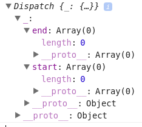
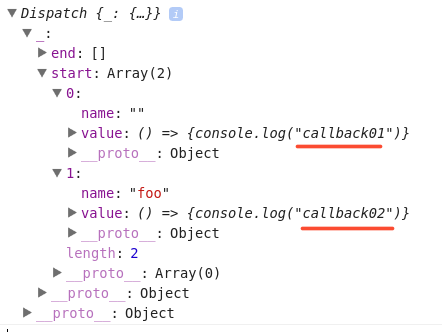
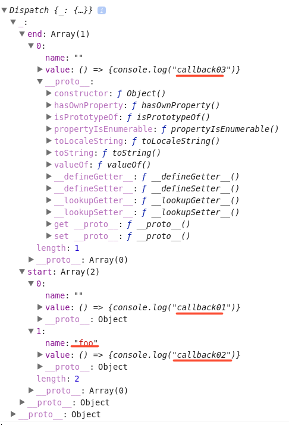

**Ghi chú**: Phần bên dưới đã không còn đúng như tài liệu nguyên gốc mà đã bị thêm vào các ghi chú cá nhân của [ngminhtrung](https://github.com/ngminhtrung).

# d3-dispatch

Dispatching is a convenient mechanism for separating concerns with loosely-coupled code: register named callbacks and then call them with arbitrary arguments. A variety of D3 components, such as [d3-request](https://github.com/d3/d3-request), use this mechanism to emit events to listeners. Think of this like Node’s [EventEmitter](https://nodejs.org/api/events.html), except every listener has a well-defined name so it’s easy to remove or replace them.

For example, to create a dispatch for *start* and *end* events:

```js
var dispatch = d3.dispatch("start", "end");
```

Object `dispatch` sẽ trông như sau:




You can then register callbacks for these events using [*dispatch*.on](#dispatch_on):

```js
const callback01 = () => {console.log("callback01")};
const callback02 = () => {console.log("callback02")};
const callback03 = () => {console.log("callback03")};
dispatch.on("start", callback01);
dispatch.on("start.foo", callback02);
dispatch.on("end", callback03);
```

Object `dispatch` sẽ lần lượt như sau:






Then, you can invoke all the *start* callbacks using [*dispatch*.call](#dispatch_call) or [*dispatch*.apply](#dispatch_apply):

```js
dispatch.call("start");
```

Like *function*.call, you may also specify the `this` context and any arguments:

```js
dispatch.call("start", {about: "I am a context object"}, "I am an argument");
```

Want a more involved example? See how to use [d3-dispatch for coordinated views](http://bl.ocks.org/mbostock/5872848).

## Installing

If you use NPM, `npm install d3-dispatch`. Otherwise, download the [latest release](https://github.com/d3/d3-dispatch/releases/latest). You can also load directly from [d3js.org](https://d3js.org), either as a [standalone library](https://d3js.org/d3-dispatch.v1.min.js) or as part of [D3 4.0](https://github.com/d3/d3). AMD, CommonJS, and vanilla environments are supported. In vanilla, a `d3` global is exported:

```html
<script src="https://d3js.org/d3-dispatch.v1.min.js"></script>
<script>

var dispatch = d3.dispatch("start", "end");

</script>
```

[Try d3-dispatch in your browser.](https://tonicdev.com/npm/d3-dispatch)

## API Reference

<a name="dispatch" href="#dispatch">#</a> d3.<b>dispatch</b>(<i>types…</i>) [<>](https://github.com/d3/d3-dispatch/blob/master/src/dispatch.js "Source")

Creates a new dispatch for the specified event *types*. Each *type* is a string, such as `"start"` or `"end"`.

<a name="dispatch_on" href="#dispatch_on">#</a> *dispatch*.<b>on</b>(<i>typenames</i>[, <i>callback</i>]) [<>](https://github.com/d3/d3-dispatch/blob/master/src/dispatch.js#L26 "Source")

Adds, removes or gets the *callback* for the specified *typenames*. If a *callback* function is specified, it is registered for the specified (fully-qualified) *typenames*. If a callback was already registered for the given *typenames*, the existing callback is removed before the new callback is added.

The specified *typenames* is a string, such as `start` or `end.foo`. The type may be optionally followed by a period (`.`) and a name; the optional name allows multiple callbacks to be registered to receive events of the same type, such as `start.foo` and `start.bar`. To specify multiple typenames, separate typenames with spaces, such as `start end` or `start.foo start.bar`.

To remove all callbacks for a given name `foo`, say `dispatch.on(".foo", null)`.

If *callback* is not specified, returns the current callback for the specified *typenames*, if any. If multiple typenames are specified, the first matching callback is returned.

<a name="dispatch_copy" href="#dispatch_copy">#</a> *dispatch*.<b>copy</b>() [<>](https://github.com/d3/d3-dispatch/blob/master/src/dispatch.js#L49 "Source")

Returns a copy of this dispatch object. Changes to this dispatch do not affect the returned copy and <i>vice versa</i>.

<a name="dispatch_call" href="#dispatch_call">#</a> *dispatch*.<b>call</b>(<i>type</i>[, <i>that</i>[, <i>arguments…</i>]]) [<>](https://github.com/d3/d3-dispatch/blob/master/src/dispatch.js#L54 "Source")

Like [*function*.call](https://developer.mozilla.org/en-US/docs/Web/JavaScript/Reference/Global_Objects/Function/call), invokes each registered callback for the specified *type*, passing the callback the specified *arguments*, with *that* as the `this` context. See [*dispatch*.apply](#dispatch_apply) for more information.

<a name="dispatch_apply" href="#dispatch_apply">#</a> *dispatch*.<b>apply</b>(<i>type</i>[, <i>that</i>[, <i>arguments</i>]]) [<>](https://github.com/d3/d3-dispatch/blob/master/src/dispatch.js#L59 "Source")

Like [*function*.apply](https://developer.mozilla.org/en-US/docs/Web/JavaScript/Reference/Global_Objects/Function/call), invokes each registered callback for the specified *type*, passing the callback the specified *arguments*, with *that* as the `this` context. For example, if you wanted to dispatch your *custom* callbacks after handling a native *click* event, while preserving the current `this` context and arguments, you could say:

```js
selection.on("click", function() {
  dispatch.apply("custom", this, arguments);
});
```

You can pass whatever arguments you want to callbacks; most commonly, you might create an object that represents an event, or pass the current datum (*d*) and index (*i*). See [function.call](https://developer.mozilla.org/en/JavaScript/Reference/Global_Objects/Function/Call) and [function.apply](https://developer.mozilla.org/en/JavaScript/Reference/Global_Objects/Function/Apply) for further information.
